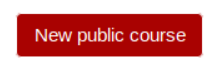
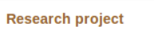
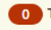
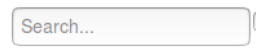

# Design guidelines for expertiza UI


## Homepage (Danish)

For the Homepage we have only used one CSS class apart from native bootstrap and that is for crousel. However, this css class is not necessary for other pages unless you want to include a crousel on your page. 

To make a page similar to Homepage following steps can be followed.

* #### To add Crousel


   - Add an outer div `<div class="carousel slide" data-ride="carousel">`.
   + Inside this div you can define optional page indicators with `<ol>` Tag
   - After this to include the data or items in crousel use `<div class="carousel-inner" role="listbox">`.
   - Inside this div define individual items like `<div class="item">` 
   - To make an item active use `<div class="item active">`
   


## Header 
## logo

## Dropdown

## User Profile (sign in/out)

## Footer


## (Rui)

## Tables 

For the tables, we recommend using bootstrap table class to make tables looks unified. We already include bootstrap reference, feel free to reference that table styles. For react.js tables, we can still use [react-bootstrap-table](http://allenfang.github.io/react-bootstrap-table/) to make tables unified.


## (Pranav)

---

> Common Elements : 

**1.Element Name**
**2.Image**
**3.Usage**
**4.Guide**
**5.Code**	
|---|---|---|---|---|
|  1 |  Button - Red style |   | Any button to be added. No need to add any class  | ```<button type="submit" class="btn btn-primary pull-right new-button">New public course</button> ``` |
|  2 |  Link -  |   |  Any link to be added on page. No need to add any class | ``` <a href="/student_task/view?id=2970"> MAE277 Group Project Report</a> ```  |
|  3 |  Circled numbers |   |  Numbers that are to be styled in red circle, Kindly add class as badge | ``` <span class="badge">0</span> ```  |
|  4 |  Text Input |   | Any text input to be added on page. No need to add any class  |  ``` <input placeholder="Search..." value="" type="text"> ``` |


