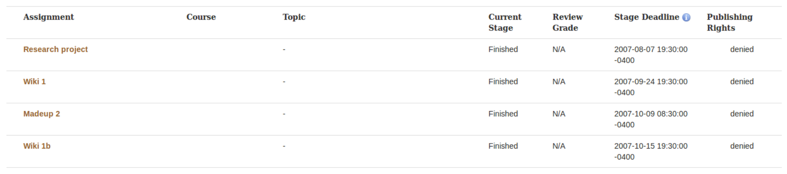
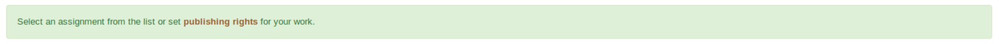
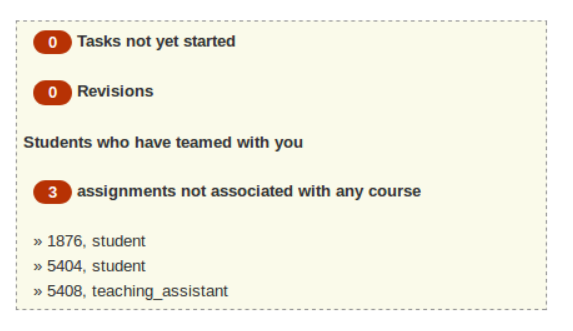

# Design guidelines for expertiza UI


## Homepage (Danish)

For the Homepage we have only used one CSS class apart from native bootstrap and that is for crousel. However, this css class is not necessary for other pages unless you want to include a crousel on your page. 

To make a page similar to Homepage following steps can be followed.

* #### To add Crousel


   - Add an outer div `<div class="carousel slide" data-ride="carousel">`.
   + Inside this div you can define optional page indicators with `<ol>` Tag
   - After this to include the data or items in crousel use `<div class="carousel-inner" role="listbox">`.
   - Inside this div define individual items like `<div class="item">` 
   - To make an item active use `<div class="item active">`
   


## Header 
## logo

## Dropdown

## User Profile (sign in/out)

## Footer


## (Rui)

## Tables 

For the tables, we recommend using bootstrap table class to make tables looks unified. We already include bootstrap reference, feel free to reference that table styles. For react.js tables, we can still use [react-bootstrap-table](http://allenfang.github.io/react-bootstrap-table/) to make tables unified.

---

## (Pranav)

Sections 

1. [Inner page layout](https://github.com/pranav-firake/expertiza/blob/master/design_guidelines.md#inner-page-layout)
   Use these layout guielines while starting to design inner-page
   
2. [Common Elements on html page](https://github.com/pranav-firake/expertiza/blob/master/design_guidelines.md#common-elements-)
   Guidelines for common html elements
   
3. [Icon Library](https://github.com/pranav-firake/expertiza/blob/master/design_guidelines.md#icon-library)
   Use this Icon library for any icons in expertiza
   
   
---

## Inner Page Layout  
   
---
**Sr. No.**
**Element Name**
**Image**
**Guide**
**Code**	
|---|---|---|---|---|
|  1 |  Heading |   | To add 'heading to page' icon,  Use H1 tag | ```  <h1> List of Deployments </h1> ``` |
|  2 |  Table / Grid |   | If adding table Please add ```class=”table”``` code | ```  <table class="table"<tbody> ... </tbody></table> ``` |
|  3 |  Notification |   | For notification, add class as ```class="flash_note alert alert-success"``` | ```  <div class="flash_note alert alert-success">Select an assignment from the list or set <strong><a href="/publishing/view">publishing rights</a></strong> for your work. </div> ``` |
|  4 |  taskbox |   | Taskbox summarizes user's current events or pending items  |  |


---

## Common Elements : 

**Sr. No.**
**Element Name**
**Image**
**Guide**
**Code**	
|---|---|---|---|---|
|  1 |  Button - Red style |   | Any button to be added. No need to add any class  | ```<button type="submit" class="btn btn-primary pull-right new-button">New public course</button> ``` |
|  2 |  Link -  |   |  Any link to be added on page. No need to add any class | ``` <a href="/student_task/view?id=2970"> MAE277 Group Project Report</a> ```  |
|  3 |  Circled numbers |   |  Numbers that are to be styled in red circle, Kindly add class as badge | ``` <span class="badge">0</span> ```  |
|  4 |  Text Input |   | Any text input to be added on page. No need to add any class  |  ``` <input placeholder="Search..." value="" type="text"> ``` |


---

## Icon Library 

> Icons are available in 4 sizes : 16, 24, 32, 48. It is possibility that we might not have all sizes for all icons.
> Edit the number as per size chose, everything else will remain same

Icon Palette : 

| ||||||||
|||| ||| | |
||  |  ||| | | |

---

**Sr. No.**
**Element Name**
**Image**
**Guide**
**Code**		
|---|---|---|---|---|
|  1 |  Add assignment |   | To add 'add assignment' icon, use path **```/assets/tree_view/add-assignment-24.png```** | ``` ``` |
|  2 |  Add Teaching assistant |   | To add 'add TA' icon, use path **```/assets/tree_view/add-ta-24.png```** | ``` ``` |
|  3 |  Add Private |   | To add 'add private' icon, use path **```/assets/tree_view/add-private-24.png```** | ``` ``` |
|  4 |  Add Public |   | To add 'add public' icon, use path **```/assets/tree_view/add-public-24.png```** | ``` ``` |
|  5 |  Add Signup Sheet |   | To add 'add signup sheet' icon, use path **```/assets/tree_view/add-signup-sheet-24.png```** | ``` ``` |
|  6 |  Assign Course Blue |   | To add 'Assign Course Blue' icon, use path **```/assets/tree_view/add-course-blue-24.png```** | ``` ``` |
|  7 |  Assign Course Green |   | To add 'Assign Course Green' icon, use path **```/assets/tree_view/add-course-green-24.png```** | ``` ``` |
|  8 |  Assign survey to |   | To add 'Assign survey to' icon, use path **```/assets/tree_view/assign-survey-24.png```** | ``` ``` |
|  9 |  Copy |   | To add "Copy" icon, use path **```/assets/tree_view/Copy-icon-24.png```** | ``` ``` |
|  10 |  Create Team |   | To add 'Create Team' icon, use path **```/assets/tree_view/create-teams-24.png```** | ``` ``` |
|  11 |  Delete |   | To add "Delete" icon, use path **```/assets/tree_view/delete-icon-24.png```** | ``` ``` |
|  12 |  (General) Edit |   | To add "Edit" icon, use path **```/assets/tree_view/edit-icon-24.png```** | ``` ``` |
|  13 |  Edit Signup sheet |   | To add "Edit Signup sheet" icon, use path **```/assets/tree_view/edit-signup-sheet-24.png```** | ``` ``` |
|  14 |  List All |   | To add "List All" icon, add class as "glyphicon glyphicon-list-alt" | ```<span class="glyphicon glyphicon-list-alt"></span> ``` |
|  15 |  List Submissions |   | To add "List Submissions" icon, use path **```/assets/tree_view/List-submisstions-24.png```** | ``` ``` |
|  16 |  Make public from private |   | To add "Make public from private" icon,  use path **```/assets/tree_view/lock-off-disabled-icon-24.png```**   | ``` ``` |
|  17 |  Private |   | To add "Private" icon,  use path **```/assets/tree_view/lock-disabled-icon-24.png```**   | ``` ``` |
|  18 |  Remove from Course |   | To add "Remove from Course" icon,  use path **```/assets/tree_view/remove-from-course-24.png```**   | ``` ``` |
|  19 |  Run Lottery |   | To add "Run Lottery" icon,  use path **```/assets/tree_view/run-lottery.png```**   | ``` ``` |
|  20 |  Search in data |   | To add "Search in data" icon,  use path **```/assets/tree_view/view-publish-rights-24.png```**   | ``` ``` |
|  21 |  View Review Report |   | To add "View Review Report " icon,  use path **```/assets/tree_view/view-review-report-24.png```**   | ``` ``` |
|  22 |  View Scores |   | To add "View Score" icon,  use path **```/assets/tree_view/view-scores-24.png```**   | ``` ``` |
|  23 |  View Suggestions |   | To add "View Suggestions" icon,  use path **```/assets/tree_view/view-suggestion-24.png```**   | ``` ``` |
|  24 |  View Survey |   | To add "View Survey" icon,  use path **```/assets/tree_view/view-survey-24.png```**   | ``` ``` |


